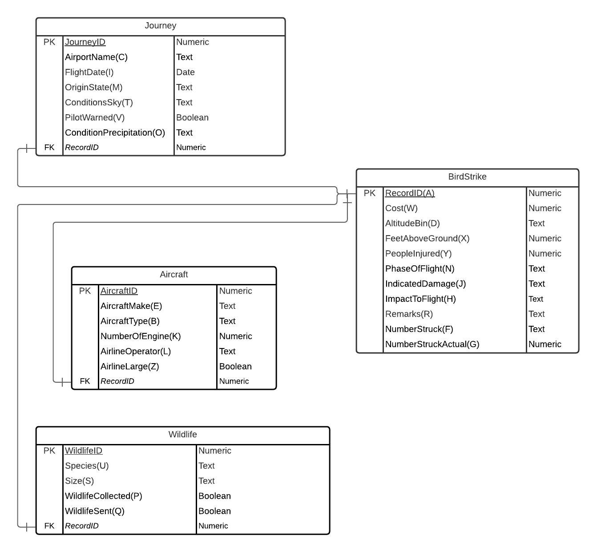

We completed the practicum working with a AWS hosted MySQL database. 

```{r}
# 1. Library
library(RMySQL)

# 2. Settings
db_user <- 'saisankar'
db_password <- 'CS5200NEU'
db_name <- 'saidb'
db_host <- 'saidb.cyxbppiqnraw.us-east-1.rds.amazonaws.com' # AWS Host
db_port <- 3306

# 3. Read data from db
mydb <-  dbConnect(MySQL(), user = db_user, password = db_password,
                 db_name = db_name, host = db_host, port = db_port)
```

# ERD diagram attached

We have have segregated the data into 4 different tables which each represent 
the individual entities better. The foreign key in the child tables (recordID) 
binds all the data together. We initially thought of a different approach having 
many to many relationship that reduced the redundancy, but given the timeframe 
of the practicum we decided to go ahead with this 1:1 approach.


Using the relevant database before running other chunks. 
```{sql connection=mydb}
USE saidb;
```

Note:- Each of the sections below deal with creation of the respective table and 
data population. 

## BirdStrike Table

### Creating BirdStrike Table. 

This follows the ERD diagram schema for BirdStrike, the recordID is the primary 
key here.
```{sql connection=mydb}
CREATE TABLE IF NOT EXISTS BirdStrike (
  RecordID INT NOT NULL,
  Cost INT NOT NULL DEFAULT 0,
  AltitudeBin VARCHAR(100) NOT NULL DEFAULT "< 1000 ft",
  FeetAboveGround INT NOT NULL DEFAULT 0,
  PeopleInjured INT NOT NULL DEFAULT 0,
  PhaseOfFlight VARCHAR(100),
  IndicatedDamage VARCHAR(100) NOT NULL DEFAULT "No damage",
  ImpactToFlight VARCHAR(100) DEFAULT "None",
  Remarks LONGTEXT,
  NumberStruck VARCHAR(100) NOT NULL DEFAULT "0",
  NumberStruckActual INT NOT NULL DEFAULT 0,
  PRIMARY KEY ( RecordID )
); 
```
```{sql connection=mydb}
DESCRIBE saidb.BirdStrike;
```
```{sql connection=mydb}
DROP TABLE BirdStrike;
```
```{sql connection=mydb}
SELECT * FROM BirdStrike;
```

Reading the CSV and creating a new df for BirdStrike that has been renamed 
according to the columns in the database. 
```{r}
df <- read.csv(file = "BirdStrikesData.csv", 
               header = T
              )
names(df)[1] <- "Record.ID"
head(df)
```

```{r}
names(df)
```

```{r}
birdstrike_df <- df[c("Record.ID", 
                      "Cost..Total..", 
                      "Altitude.bin", 
                      "Feet.above.ground", 
                      "Number.of.people.injured", 
                      "When..Phase.of.flight",
                      "Effect..Indicated.Damage",
                      "Effect..Impact.to.flight",
                      "Remarks",
                      "Wildlife..Number.struck",
                      "Wildlife..Number.Struck.Actual"
                      )]
names(birdstrike_df)[1] <- "RecordID"
names(birdstrike_df)[2] <- "Cost"
names(birdstrike_df)[3] <- "AltitudeBin"
names(birdstrike_df)[4] <- "FeetAboveGround"
names(birdstrike_df)[5] <- "PeopleInjured"
names(birdstrike_df)[6] <- "PhaseOfFlight"
names(birdstrike_df)[7] <- "IndicatedDamage"
names(birdstrike_df)[8] <- "ImpactToFlight"
names(birdstrike_df)[9] <- "Remarks"
names(birdstrike_df)[10] <- "NumberStruck"
names(birdstrike_df)[11] <- "NumberStruckActual"
birdstrike_df
```

Here we add the data to the Table finally using dbWriteTable.
```{r}
dbWriteTable(mydb, "BirdStrike", birdstrike_df[1:nrow(birdstrike_df),], append = TRUE,row.names = FALSE)
```

## Journey Table

### Creating Journey Table. 

Journey related attributes are segregated into this schema called the Journey 
table. We have added couple of default values that relates best to the given 
data. 

```{sql connection=mydb}
CREATE TABLE IF NOT EXISTS Journey (
  JourneyID INT NOT NULL AUTO_INCREMENT,
  AirportName VARCHAR(100) NOT NULL,
  FlightDate DATE NOT NULL,
  OriginState VARCHAR(100) NOT NULL,
  ConditionsSky VARCHAR(100) NOT NULL DEFAULT "N/A",
  PilotWarned boolean NOT NULL DEFAULT 0,
  ConditionPrecipitation VARCHAR(100) NOT NULL DEFAULT "None",
  RecordID INT NOT NULL,
  PRIMARY KEY ( JourneyID ),
  FOREIGN KEY (RecordID) references BirdStrike(RecordID)
    ON DELETE CASCADE
    ON UPDATE CASCADE
); 
```
```{sql connection=mydb}
DESCRIBE Journey;
```

```{sql connection=mydb}
DROP TABLE Journey;
```

```{sql connection=mydb}
SELECT * FROM Journey;
```

Finally creating the journey df. 
```{r}
journey_df <- df[c("Airport..Name", 
                    "FlightDate", 
                    "Origin.State", 
                    "Conditions..Sky", 
                    "Pilot.warned.of.birds.or.wildlife.",
                    "Conditions..Precipitation",
                    "Record.ID"
                  )]
names(journey_df)[1] <- "AirportName"
names(journey_df)[2] <- "FlightDate"
names(journey_df)[3] <- "OriginState"
names(journey_df)[4] <- "ConditionsSky"
names(journey_df)[5] <- "PilotWarned"
names(journey_df)[6] <- "ConditionPrecipitation"
names(journey_df)[7] <- "RecordID"
journey_df$JourneyID <- rownames(journey_df)
col_idx <- grep("JourneyID", names(journey_df))
journey_df <- journey_df[, c(col_idx, (1:ncol(journey_df))[-col_idx])]
journey_df$FlightDate <- strptime(as.character(journey_df$FlightDate), "%m/%d/%Y")
journey_df$FlightDate <- format(journey_df$FlightDate, "%Y-%m-%d")
journey_df
```

And inserting into the database - 
```{r}
dbWriteTable(mydb, "Journey", journey_df[1:nrow(journey_df),], append = TRUE,row.names = FALSE)
```

## Aircraft Table

### Creating Aircraft Table. 

Aircraft related attributes are segregated into this schema called the Aircraft 
table. We have added couple of default values that relates best to the given 
data. 

```{sql connection=mydb}
CREATE TABLE IF NOT EXISTS Aircraft (
  AircraftID INT NOT NULL AUTO_INCREMENT,
  AircraftMake VARCHAR(100) NOT NULL,
  AircraftType VARCHAR(100) NOT NULL DEFAULT "Airplane",
  NumberOfEngine INT,
  AirlineOperator VARCHAR(100),
  AirlineLarge boolean NOT NULL DEFAULT 0,
  RecordID INT NOT NULL,
  FOREIGN KEY (RecordID) references BirdStrike(RecordID)
    ON DELETE CASCADE
    ON UPDATE CASCADE,
  PRIMARY KEY ( AircraftID )
); 
```
```{sql connection=mydb}
DESCRIBE Aircraft;
```

```{sql connection=mydb}
DROP TABLE Aircraft;
```

```{sql connection=mydb}
SELECT * FROM Aircraft;
```

```{r}
aircraft_df <- df[c("Aircraft..Make.Model", 
                    "Aircraft..Type", 
                    "Aircraft..Number.of.engines.", 
                    "Aircraft..Airline.Operator", 
                    "Is.Aircraft.Large.", 
                    "Record.ID")]
names(aircraft_df)[1] <- "AircraftMake"
names(aircraft_df)[2] <- "AircraftType"
names(aircraft_df)[3] <- "NumberOfEngine"
names(aircraft_df)[4] <- "AirlineOperator"
names(aircraft_df)[5] <- "AirlineLarge"
names(aircraft_df)[6] <- "RecordID"
aircraft_df$AirlineLarge <- as.integer(aircraft_df$AirlineLarge == "Yes")
aircraft_df$AircraftID <- rownames(aircraft_df)
col_idx <- grep("AircraftID", names(aircraft_df))
aircraft_df <- aircraft_df[, c(col_idx, (1:ncol(aircraft_df))[-col_idx])]
aircraft_df
```

Finally writing the data into the table - 
```{r}
dbWriteTable(mydb, "Aircraft", aircraft_df[1:nrow(aircraft_df),], append = TRUE,row.names = FALSE)
```

## Wildlife Table

### Creating Wildlife Table. 

Wildlife related attributes are segregated into this schema called the Wildlife 
table. We have added couple of default values that relates best to the given 
data. 

```{sql connection=mydb}
CREATE Table IF NOT EXISTS Wildlife (
  WildLifeID INT NOT NULL AUTO_INCREMENT,
  Species VARCHAR(100) NOT NULL,
  Size VARCHAR(100) NOT NULL DEFAULT "N/A",
  WildlifeCollected BOOLEAN NOT NULL DEFAULT 0,
  WildlifeSent BOOLEAN NOT NULL DEFAULT 0,
  CHECK (Size IN ('Small','Medium','Large','N/A')),
  RecordID INT NOT NULL,
  FOREIGN KEY (RecordID) references BirdStrike(RecordID)
    ON DELETE CASCADE
    ON UPDATE CASCADE,
  PRIMARY KEY ( WildLifeID )
)
```
```{sql connection=mydb}
DESCRIBE Wildlife;
```
```{sql connection=mydb}
DROP TABLE Wildlife;
```

```{sql connection=mydb}
SELECT * FROM Wildlife;
```

```{r}
wildlife_df <- df[c("Wildlife..Species", 
                    "Wildlife..Size", 
                    "Remains.of.wildlife.collected.", 
                    "Remains.of.wildlife.sent.to.Smithsonian",
                    "Record.ID"
                    )]
names(wildlife_df)[1] <- "Species"
names(wildlife_df)[2] <- "Size"
names(wildlife_df)[3] <- "WildlifeCollected"
names(wildlife_df)[4] <- "WildlifeSent"
names(wildlife_df)[5] <- "RecordID"
wildlife_df$WildlifeCollected <- as.integer(wildlife_df$WildlifeCollected == "TRUE")
wildlife_df$WildlifeSent <- as.integer(wildlife_df$WildlifeSent == "TRUE")
wildlife_df$Size= replace(wildlife_df$Size, wildlife_df$Size == "", paste0("N/A"))
wildlife_df$WildLifeID <- rownames(wildlife_df)
col_idx <- grep("WildLifeID", names(wildlife_df))
wildlife_df <- wildlife_df[, c(col_idx, (1:ncol(wildlife_df))[-col_idx])]
wildlife_df
```

Writing wildlife related data into the table from the df - 
```{r}
dbWriteTable(mydb, "Wildlife", wildlife_df[1:nrow(wildlife_df),], append = TRUE,row.names = FALSE)
```

### Q4
Create a SQL query against your database to find the number of bird strike incidents for each airport upon take-off or climb. Include all airlines. You may either use a {sql} code chunk or an R function to execute the query.
```{sql connection=mydb}
-- Q4
SELECT AirportName, count(*) from BirdStrike
JOIN Journey ON Journey.recordID = BirdStrike.recordID
JOIN Aircraft on Aircraft.recordID = BirdStrike.recordID
WHERE BirdStrike.PhaseOfFlight IN ("Take-off run", "Climb")
GROUP BY AirportName;

```


### Q5
Create a SQL query against your database to find the airports that had the most bird strike incidents (during any flight phase). Include all airlines. You may either use a {sql} code chunk or an R function to execute the query.
```{sql connection=mydb}
-- Q5
SELECT AName as AirportName FROM 
(	
	SELECT AirportName as AName, count(*) as ACount, RANK () OVER (ORDER BY count(*) DESC) ARank
  FROM BirdStrike
	JOIN Journey ON Journey.recordID = BirdStrike.recordID
	JOIN Aircraft on Aircraft.recordID = BirdStrike.recordID
	GROUP BY AirportName
) as T
WHERE ARank = 1;
```

### Q6
Create a SQL query against your database to find the number of bird strike incidents by year. Include all airlines. You may either use a {sql} code chunk or an R function to execute the query.
```{sql connection=mydb}
-- Q6
SELECT YEAR(FlightDate) as Year, count(*) as Count
FROM BirdStrike
JOIN Journey ON Journey.recordID = BirdStrike.recordID
JOIN Aircraft on Aircraft.recordID = BirdStrike.recordID
WHERE YEAR(FlightDate) != 0
GROUP BY YEAR(FlightDate)
ORDER BY YEAR(FlightDate);
```

### Q7
Using the above data, build a line graph that visualizes the number of bird strikes incidents per year from 2000 to 2011. Adorn the graph with appropriate axis labels.

```{r}
# Q7
sql = "SELECT YEAR(FlightDate) as Year, count(*) as Count FROM BirdStrike
      JOIN Journey ON Journey.recordID = BirdStrike.recordID
      JOIN Aircraft on Aircraft.recordID = BirdStrike.recordID
      WHERE YEAR(FlightDate) != 0
      GROUP BY YEAR(FlightDate)
      ORDER BY YEAR(FlightDate)"
query <- dbSendQuery(mydb, sql)
dfplot <- fetch(query)
plot(x = dfplot$Year, y = dfplot$Count, xlab="Year", ylab="BirdStrike",type = "o")
```

### Q8
Create a stored procedure in MySQL (note that if you used SQLite, then you cannot complete this step) that adds a new bird strike incident to the database. You only need to include the following data: airport name, aircraft type, flight date, airline, flight phase. The remaining columns can be set with default values as defined by the table definitions. Show that the insertion worked as expected by retrieving and displaying the inserted data. Add any additional arguments to the stored procedure as needed.


We have added new mandatory parameters that are critical for the data model 
described above. 
And the remaining values are defaulted to the table defaults for simplicity purposes.
```{sql connection=mydb}
-- Q8
CREATE PROCEDURE InsertNewRecord(IN RecordID int, 
IN AirportName varchar(100), 
IN AircraftType varchar(100), 
IN FlightDate date, 
IN AirlineOperator varchar(100), 
IN FlightPhase varchar(100), 
IN OriginState varchar(100), 
IN AircraftMake varchar(100), 
IN Species varchar(100))
BEGIN
  INSERT into BirdStrike(RecordID,PhaseOfFlight) values(RecordID,FlightPhase);
  INSERT into Journey(AirportName,FlightDate,OriginState,RecordID) values(AirportName,FlightDate,OriginState,RecordID);
  INSERT into Aircraft(AircraftType,AirlineOperator,RecordID) values(AircraftType,AirlineOperator,RecordID);
  INSERT into Wildlife(Species,RecordID) values(Species,RecordID);
END
```

Calling the function to insert data.
```{sql connection=mydb}
CALL InsertNewRecord(45634325,'Logan Airport','Airplane','2021-03-03','United','Climb','MA','Boeing 777','Chicken');
```

Verifying that the stored proc works - 
```{sql connection=mydb}
SELECT * FROM Aircraft WHERE RecordID = 45634325;
```


```{sql connection=mydb}
DROP PROCEDURE IF EXISTS InsertNewRecord;
```


```{r}
dbDisconnect(mydb)
```